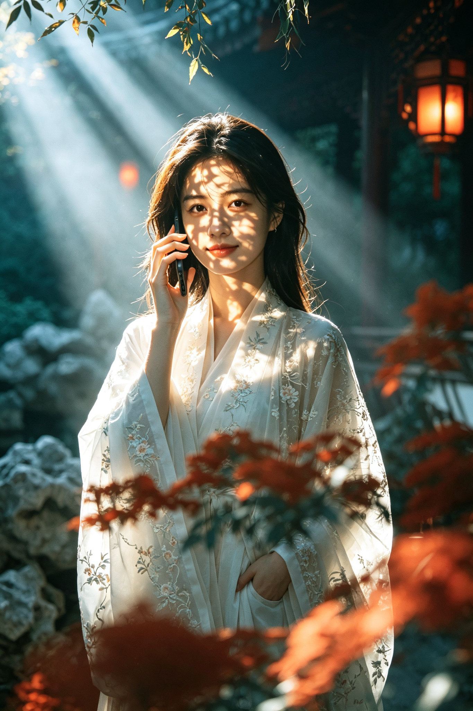
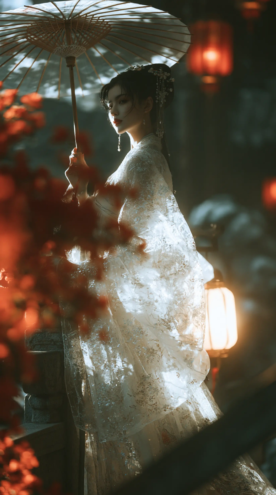
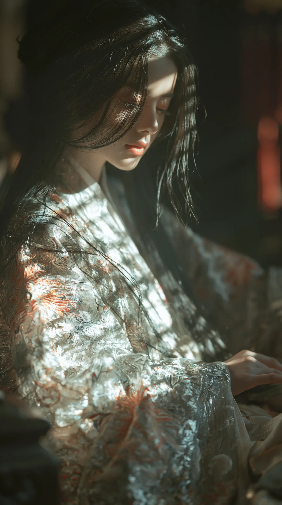
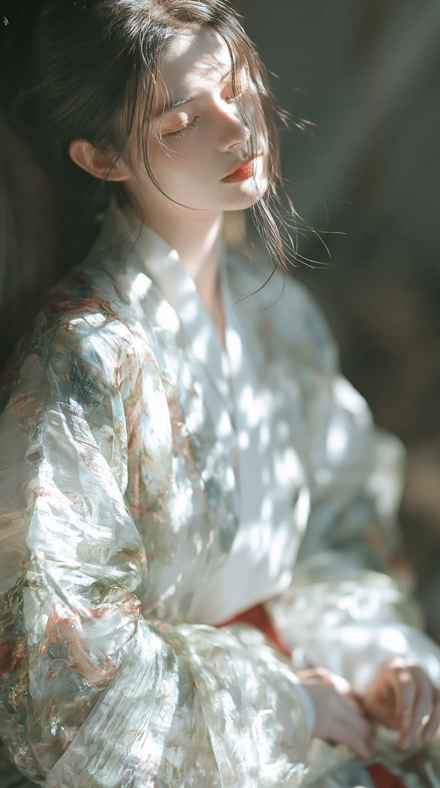
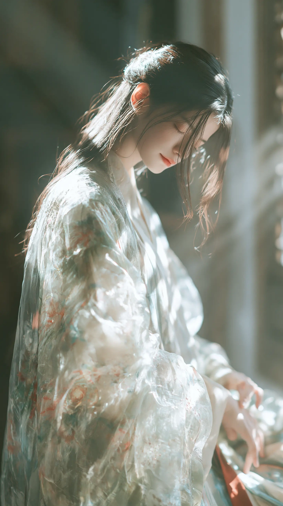

# 国风电影光影 (guofeng-cinematic-light)

将照片转换为**国风电影光影**风格——汉服美学、丁达尔光束、树影斑驳、青橙色调、电影感氛围。

## 效果演示

| 原图 | 风格转换后 |
|:---:|:---:|
|  |  |

## 风格特征

### 光影
- 强烈的丁达尔光束（God rays）从画面斜射
- 树叶/窗棂投影在人物面部和衣物上形成斑驳光斑
- 侧逆光勾勒发丝和衣物轮廓
- 明暗对比强烈，暗部深沉有层次

### 色调
- 青橙电影色调（Teal & Orange）
- 暗部偏深青蓝、墨绿
- 高光偏暖琥珀、金黄
- 红色元素（灯笼、红叶、唇色）作为点缀

### 氛围与质感
- 空灵、诗意、电影感
- 浅景深，前景虚化
- 胶片颗粒感
- 空气透视薄雾

## 风格参考

  
  
  

  
  
  

## 使用方式

在豆包中提供一张照片，说"改成国风光影风格"或"用国风电影光影处理"，即可自动将照片转换为该风格。

## 技术说明

- 基于豆包图片编辑能力实现
- 保留人物面部特征，替换服装和环境为国风元素
- 支持人物、风景、建筑等多种照片类型
