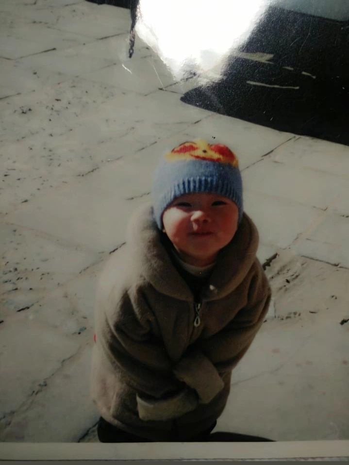
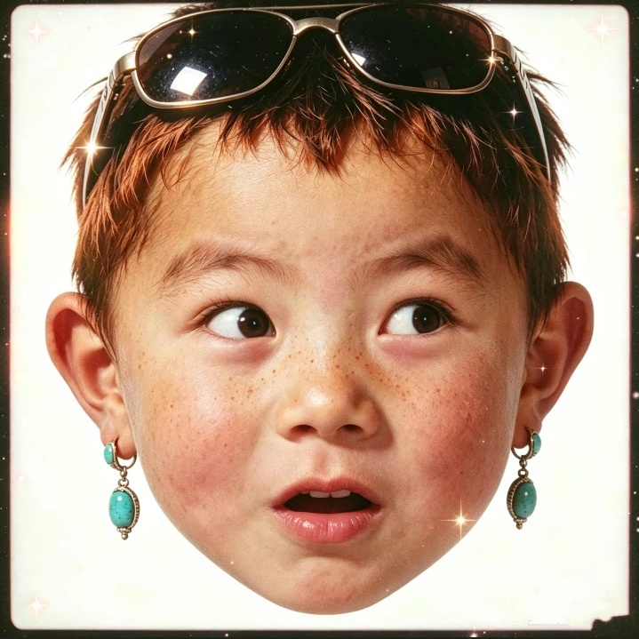
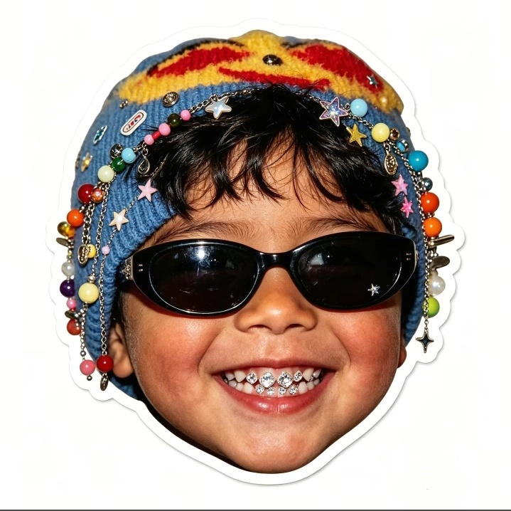
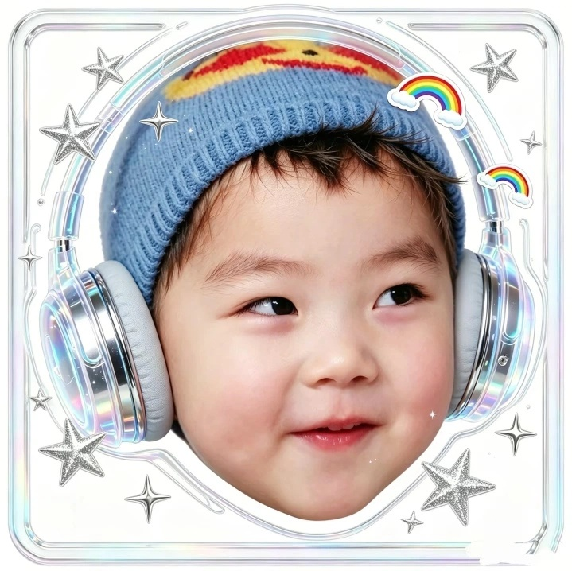
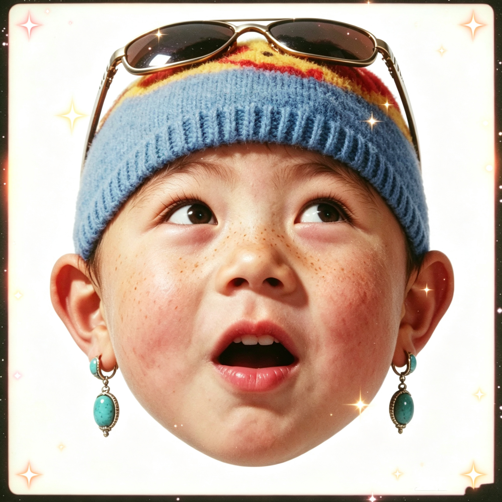
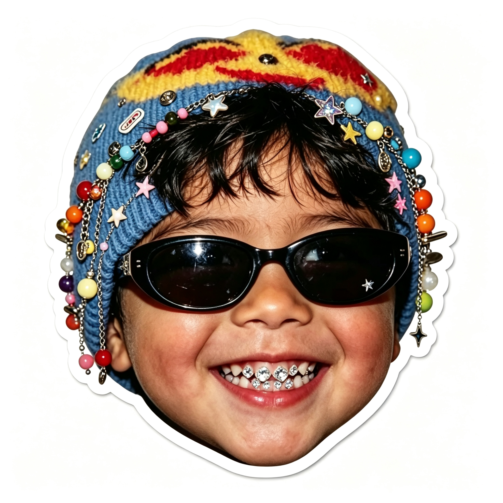
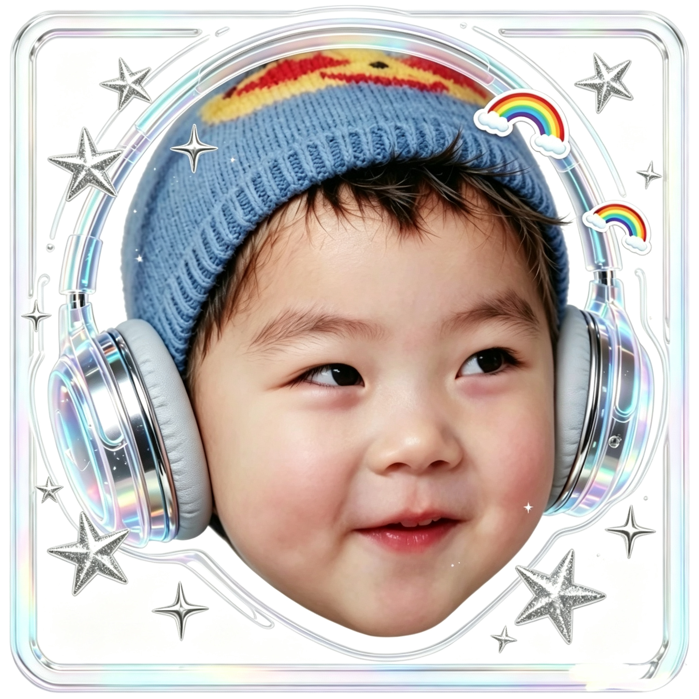

# Y2K 潮流大头贴写真（y2k-trendy-headshot）

将人物照片一键转换为 Y2K 千禧风潮流大头贴，一次输出 **3 张**不同造型的 1:1 方形头像写真。

## 效果预览

### 风格参考（用户提供的样例）

| 输入（老照片/日常照） | 变体1：墨镜+耳环 | 变体2：装饰帽+牙钻 | 变体3：镭射耳机+全息边框 |
|---|---|---|---|
|  |  |  |  |

### 技能实测输出（用上方老照片生成）

| 变体1 | 变体2 | 变体3 |
|---|---|---|
|  |  |  |

## 风格特征

- **构图**：1:1 正方形，大头特写，头部居中
- **背景**：纯白干净背景
- **保留**：人物面部五官、神态、标志性服饰（如帽子）
- **画质**：高清精致商业写真质感
- **配饰**：墨镜、绿松石耳环、装饰帽珠串、水钻牙贴、镭射耳机
- **装饰**：四角星闪光、彩虹贴纸、银色星星、宝丽来/贴纸/全息边框
- **氛围**：Y2K 千禧潮流、俏皮可爱、搞怪

## 使用方式

上传一张人物照片，说：
- "帮我做成潮流大头贴"
- "生成一组 Y2K 写真"
- "按这个风格出 3 张头像"

## 三个固定变体

1. **复古潮童**：金属框墨镜架头顶 + 绿松石耳坠 + 星星闪光 + 宝丽来边框
2. **装饰帽潮童**：彩色珠串装饰帽 + 黑框墨镜 + 水钻牙贴 + 白色描边贴纸
3. **耳机Y2K潮童**：镭射银头戴耳机 + 银色星星彩虹 + 全息透明边框
